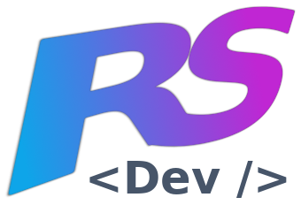

<a name="readme-top"></a>

<div align="center">
  <!-- You are encouraged to replace this logo with your own! Otherwise you can also remove it. -->
  
  <br/>

  <h3><b>Microverse Internship Challenge</b></h3>

</div>

<!-- TABLE OF CONTENTS -->

# 📗 Table of Contents

- [📖 About the Project](#about-project)
  - [🛠 Built With](#built-with)
    - [Tech Stack](#tech-stack)
    - [Key Features](#key-features)
  - [🚀 Live Demo](#live-demo)
- [💻 Getting Started](#getting-started)
  - [Setup](#setup)
  - [Prerequisites](#prerequisites)
  - [Install](#install)
  - [Usage](#usage)
  - [Run tests](#run-tests)
  - [Deployment](#triangular_flag_on_post-deployment)
- [👥 Authors](#authors)
- [🔭 Future Features](#future-features)
- [🤝 Contributing](#contributing)
- [⭐️ Show your support](#support)
- [🙏 Acknowledgements](#acknowledgements)
- [❓ FAQ](#faq)
- [📝 License](#license)

<!-- PROJECT DESCRIPTION -->

# 📖 Microverse Internship Challenge <a name="about-project"></a>


**Microverse Internship Challenge** is a webapp that fetches users from an external API via a sidekiq worker and renders them with filters and pagination.

## 🛠 Built With <a name="built-with"></a>

### Tech Stack <a name="tech-stack"></a>


<details>
  <summary>Client</summary>
  <ul>
    <li>TailwindCSS</li>
  </ul>
</details>

<details>
  <summary>Server</summary>
  <ul>
    <li>Ruby on Rails</li>
    <li>Sidekiq</li>
    <li>Redis</li>
  </ul>
</details>

<details>
<summary>Database</summary>
  <ul>
    <li>PostgreSQL</li>
  </ul>
</details>

<!-- Features -->

### Key Features <a name="key-features"></a>


- **The application fetches users via a Sidekiq worker that runs every minute to keep the external API synced with the internal DB**
- **The frontend views allow the user to add constraints to the list like filtering by status, limit of records and pagination**
- **The endpoints can either be consumed as a regular page (HTML views) or as an web service json api.**

<p align="right">(<a href="#readme-top">back to top</a>)</p>

<!-- LIVE DEMO -->

## 🚀 Live Demo <a name="live-demo"></a>


- TBA

<p align="right">(<a href="#readme-top">back to top</a>)</p>

<!-- GETTING STARTED -->

## 💻 Getting Started <a name="getting-started"></a>


To get a local copy up and running, follow these steps.

### Prerequisites

In order to run this project you need:

- Ruby installed (2.6.0)
- Bundler installed
- Redis service up and running
- A PostgreSQL database with rights to create a new database

### Setup

Clone this repository to your desired folder:


```sh
  git clone git@github.com:rskinnerc/microverse-internship-challenge.git
```

### Install

Install this project with:


```sh
  cd microverse-internship-challenge
  bundle install
```


### Usage

To run the project, execute the following command:


```sh
  rails db:create
  rails db:migrate
  rails server
```

Then, in another terminal window, run:

```sh
  sidekiq
```


### Run tests

To run tests, run the following command:


```sh
  rspec
```

### Deployment

You can deploy this project using:

You can deploy this application to your prefered provider. The only requirement is that you need to have a PostgreSQL database and Redis server available.

<p align="right">(<a href="#readme-top">back to top</a>)</p>

<!-- AUTHORS -->

## 👥 Authors <a name="authors"></a>


👤 **Ronald Skinner**

- GitHub: [@rskinnerc](https://github.com/rskinnerc)
- Twitter: [@XSkinner](https://twitter.com/XSkinner)
- LinkedIn: [LinkedIn](https://linkedin.com/in/rskinnerc)

<p align="right">(<a href="#readme-top">back to top</a>)</p>

<!-- FUTURE FEATURES -->

## 🔭 Future Features <a name="future-features"></a>


- [ ] **Add Hotwire Turbo**
- [ ] **Improve UX/UI**
- [ ] **Add feature/system tests to the users controller**

<p align="right">(<a href="#readme-top">back to top</a>)</p>

<!-- CONTRIBUTING -->

## 🤝 Contributing <a name="contributing"></a>

Contributions, issues, and feature requests are welcome!

Feel free to check the [issues page](../../issues/).

<p align="right">(<a href="#readme-top">back to top</a>)</p>

<!-- SUPPORT -->

## ⭐️ Show your support <a name="support"></a>


If you like this project... Just hire me! ;)

<p align="right">(<a href="#readme-top">back to top</a>)</p>

<!-- ACKNOWLEDGEMENTS -->

## 🙏 Acknowledgments <a name="acknowledgements"></a>


I would like to thank Microverse for their continuos support and guidance.

<p align="right">(<a href="#readme-top">back to top</a>)</p>

<!-- FAQ (optional) -->

## ❓ FAQ <a name="faq"></a>


- **Why is your project not deployed?**

  - Since it requires a PostgreSQL databa along with a Redis server, it is not possible to deploy it to a free hosting service like Heroku.

- **Why the worker keeps running every minute even though the database is already synced with the external API?**

  - At the very beginning, the worker fetches 100 records from the external API and stores them in the database. After that, it keeps running every minute to check if there are new records in the external API. If there are, it fetches them and stores them in the database.

<p align="right">(<a href="#readme-top">back to top</a>)</p>

<!-- LICENSE -->

## 📝 License <a name="license"></a>

This project is [MIT](./MIT.md) licensed.


<p align="right">(<a href="#readme-top">back to top</a>)</p>